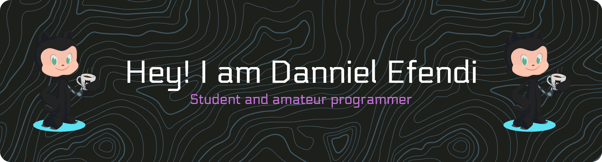

# Hi there 👋

## 💫 About Me:
🌱 I’m currently learning Laravel and Flutter Framework

## 🌐 Socials  
 

# 💻 Tech Stack:
                      
# 📊 GitHub Stats:
 
 

<!-- Proudly created with GPRM ( https://gprm.itsvg.in ) -->